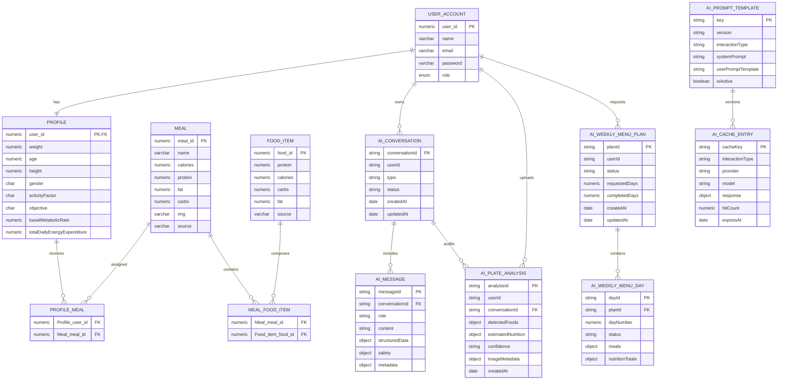
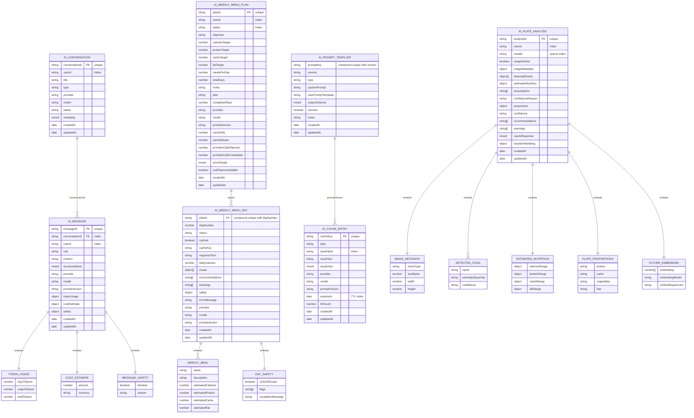
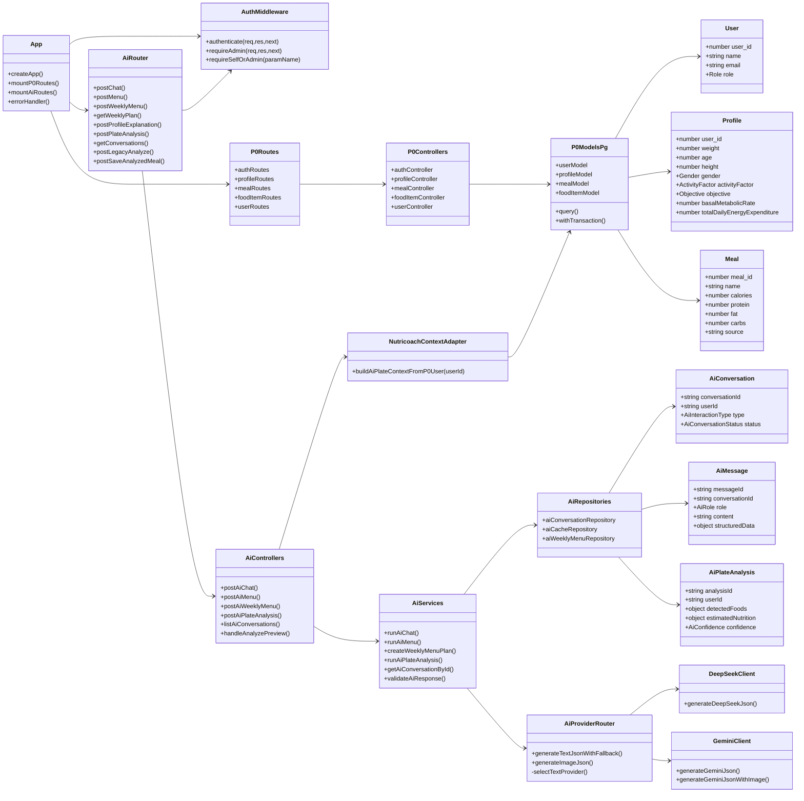
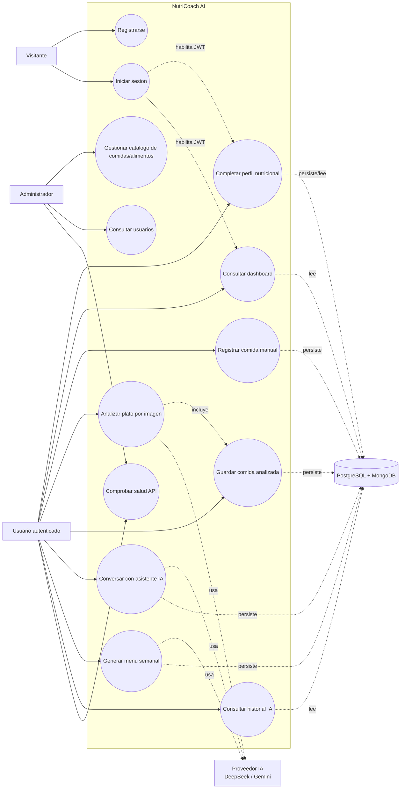

# Diagramas tecnicos — NutriCoach

Estos diagramas documentan el estado auditado del proyecto en la rama `integration/full-integration-sanitized`.
Estan escritos en Mermaid para que GitHub los renderice directamente y puedan mantenerse junto al codigo.

## 1. Diagrama ER

El diagrama ER combina la base funcional PostgreSQL y las colecciones principales de MongoDB usadas por el modulo IA.
Las relaciones entre PostgreSQL y MongoDB son logicas por `userId`; no son claves foraneas fisicas entre motores.

Fuente Mermaid independiente: [`diagrams/er-diagram.mmd`](diagrams/er-diagram.mmd).

## 2. Diagrama MongoDB

Este diagrama representa de forma especifica las colecciones del modulo IA en MongoDB, sus campos principales, subdocumentos embebidos e indices relevantes.

Fuente Mermaid independiente: [`diagrams/mongo-schema-diagram.mmd`](diagrams/mongo-schema-diagram.mmd).

## 3. Diagrama de clases / componentes

Este diagrama resume clases, tipos y servicios principales. No pretende listar todos los componentes React, sino representar las dependencias tecnicas relevantes.

Fuente Mermaid independiente: [`diagrams/class-diagram.mmd`](diagrams/class-diagram.mmd).

## 4. Diagrama de casos de uso

El diagrama agrupa los casos de uso del MVP. Las acciones IA siempre pasan por backend y requieren JWT salvo registro/login.

Fuente Mermaid independiente: [`diagrams/use-case-diagram.mmd`](diagrams/use-case-diagram.mmd).
